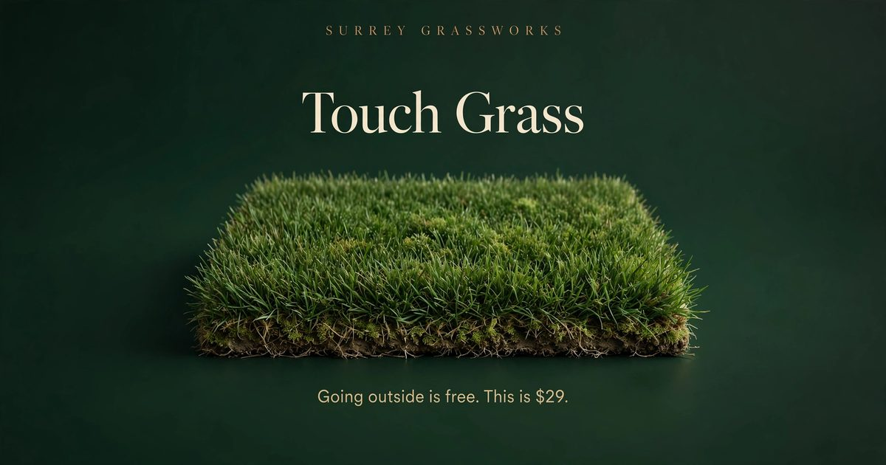

# v2.4.0 SEO + Social + Speed — Review

**Status:** built and verified locally on `production-quality`. **Not deployed, no PR.** This document is the review artifact — nothing here has touched the live site.

## 1. OG image (new)

`theme/touchgrass/assets/img/og-default.jpg` — 1200×630, 81 KB.



Art direction: premium studio photograph of a perfect grass rectangle on deep forest green, cream Fraunces-style serif "Touch Grass" headline, letterspaced "SURREY GRASSWORKS" mark, muted-gold subline "Going outside is free. This is $29." Luxury-asset treatment, not a meme. Used as the site-wide `og:image` / `twitter:image` default; product pages override with their featured image (real dimensions emitted).

## 2. `<head>` before / after

New code: `theme/touchgrass/inc/seo.php` (hooked to `wp_head`). Deliberately outputs **only the missing tags** — `og:title`, `og:type`, `og:url`, `og:site_name`, `og:locale`, and `twitter:card` already come from a separate source on the live server (not from this codebase; the playground renders none of them), so re-emitting them would create duplicates.

### Homepage

Before (v2.3.0): no `description`, no `og:description`, no `og:image`, no `twitter:image`.

After (v2.4.0):
```html
<meta name="description" content="Hand-grown plots of real grass, shipped to your desk. Going outside is free. This is $29. You do the math.">
<meta property="og:description" content="Hand-grown plots of real grass, shipped to your desk. Going outside is free. This is $29. You do the math.">
<meta property="og:image" content="https://touchgrass.johnpaulpannell.com/wp-content/themes/touchgrass/assets/img/og-default.jpg">
<meta property="og:image:width" content="1200">
<meta property="og:image:height" content="630">
<meta property="og:image:alt" content="Touch Grass — premium plots of real grass">
<meta name="twitter:image" content="https://touchgrass.johnpaulpannell.com/wp-content/themes/touchgrass/assets/img/og-default.jpg">
```
Plus Organization + WebSite JSON-LD (new; FAQPage JSON-LD unchanged).

### Product page (The Daily Driver)

Before: same gaps as homepage.

After:
```html
<meta name="description" content="Our flagship rectangle of grass.">
<meta property="og:description" content="Our flagship rectangle of grass.">
<meta property="og:image" content="…/uploads/2026/09/daily.webp">
<meta property="og:image:width" content="1792">
<meta property="og:image:height" content="1344">
<meta property="og:image:alt" content="The Daily Driver">
<meta name="twitter:image" content="…/uploads/2026/09/daily.webp">
```
Plus Product JSON-LD (validated parseable in tests):
```json
{"@type":"Product","name":"The Daily Driver","brand":{"name":"Surrey Grassworks"},
 "offers":{"price":"29","priceCurrency":"USD","availability":"https://schema.org/InStock"}}
```
Availability reflects real stock status. Description sources: product short description → tagline → fallback; ~155 chars, word-boundary trimmed.

## 3. Performance before / after

Measured in the playground (wget full mirror of homepage + one PDP, 90 files).

| Metric | Before (v2.3.0) | After (v2.4.0) |
|---|---|---|
| Homepage images with `loading="lazy"` | 2 / 12 | 11 / 12 |
| Hero image `fetchpriority` | absent | `high` (LCP) |
| Images with explicit `width`+`height` (no CLS) | 10 / 12 | 12 / 12 |
| `font-display` | `swap` (already) | `swap` (unchanged) |
| Total mirror bytes (home + PDP) | ~4.4 MB | ~4.2 MB |

Top 5 heaviest assets (unchanged by this pass): Inter variable fonts ×4 (~1.3 MB combined), `daily.webp` full-size (464 KB, only in srcset — gallery loads the 600px variant), `hands.webp` (389 KB), `night.webp` (338 KB), `desk.webp` (329 KB).

**Honest notes:**
- The byte delta is small because a full mirror fetches everything; the real wins are behavioral: 9 below-fold thumbnails now defer off the initial load, the LCP hero is prioritized, and layout shift is eliminated on the two hardcoded images.
- `loading="lazy"` on product cards required a targeted `wp_get_loading_optimization_attributes` filter: WordPress 7.1's loading optimizer was stripping an explicitly-passed `loading="lazy"` from `WC_Product::get_image()` output (it misclassifies grid thumbnails as possibly in-viewport). The filter forces lazy only for `attachment-woocommerce_thumbnail` images, which are always below the fold on this theme.
- **Not changed (flagged, not fixed):** the ~1.3 MB Inter webfont payload (4 weights). Cutting weights would alter the design; recommend a type-scale audit as separate work. jQuery (86 KB, render-blocking) left alone — deferring it is not trivially safe with WooCommerce.

## 4. What shipped in v2.4.0

- `inc/seo.php` (new): meta description, og:description, og:image/twitter:image with dimensions, Product + Organization/WebSite JSON-LD.
- `assets/img/og-default.jpg` (new): 1200×630 social image.
- Performance: `fetchpriority="high"` on hero, `loading="lazy"` on product-card / ritual / sticky-ATC thumbnails (via filter), `width`/`height` on hardcoded images.
- i18n: both `.pot` files regenerated.
- Tests: integration 108/108 (17 new), HTTP 59/59 (12 new). Screenshots re-verified (homepage + PDP, desktop + mobile) — no visual regressions.

## 5. Deferred / still open

- `.github/workflows/ci.yml` still needs the one manual web-UI add (API token lacks `workflow` scope).
- Live Buttondown subscribe, real gateway checkout/refund, email delivery remain untested (no keys).
- Font payload diet (Inter weights) — needs a design decision first.
